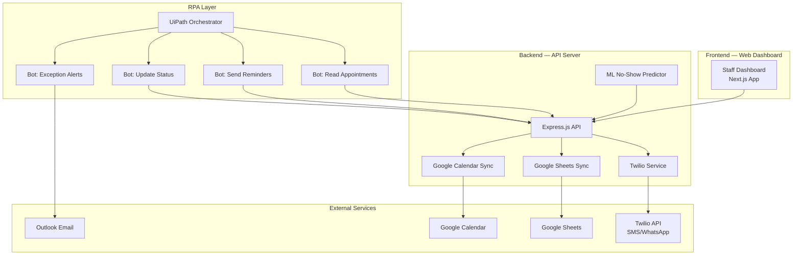
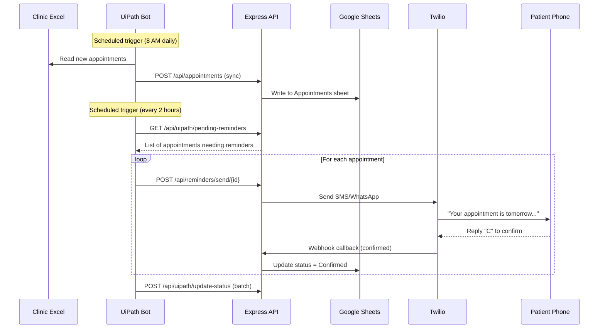

# Patient Appointment & Reminder Automation — Implementation Plan

## 🏗️ Architecture Overview



## 📦 What You'll Build

| # | Component | Tech | Purpose |
|---|-----------|------|---------|
| 1 | **Web Dashboard** | Next.js + CSS | Staff UI for appointments, patients, analytics |
| 2 | **REST API** | Express.js + Node.js | Business logic, CRUD, integrations |
| 3 | **Database** | Google Sheets (+ optional SQLite) | Appointment & patient data storage |
| 4 | **Reminder Engine** | Twilio API | SMS, WhatsApp, Email reminders |
| 5 | **UiPath Workflows** | UiPath Studio | RPA bots for automation |
| 6 | **ML Model** | Python + scikit-learn | No-show prediction |

---

## Phase 1 — Project Setup & Folder Structure

### Step 1.1: Initialize the Project

**Vibe-Code Prompt:**
> "Create a Next.js project with App Router in the current directory. Include Express.js as a custom API server. Set up the following folder structure:
> - `/app` — Next.js pages (dashboard, appointments, patients, analytics)
> - `/api` — Express.js REST API routes
> - `/lib` — Shared utilities (Twilio, Google Sheets, Calendar helpers)
> - `/models` — Data models for Patient, Appointment, Reminder
> - `/uipath` — JSON configs and scripts for UiPath integration
> - `/ml` — Python scripts for no-show prediction
> Use TypeScript throughout."

### Step 1.2: Install Dependencies

```bash
npm install express twilio googleapis nodemailer node-cron dotenv cors
npm install -D typescript @types/node @types/express
```

### Step 1.3: Environment Variables

Create `.env.local`:
```env
# Twilio
TWILIO_ACCOUNT_SID=your_sid
TWILIO_AUTH_TOKEN=your_token
TWILIO_PHONE_NUMBER=+1234567890
TWILIO_WHATSAPP_NUMBER=whatsapp:+14155238886

# Google
GOOGLE_SHEETS_ID=your_sheet_id
GOOGLE_SERVICE_ACCOUNT_EMAIL=your_email
GOOGLE_PRIVATE_KEY=your_key
GOOGLE_CALENDAR_ID=your_calendar_id

# App
API_BASE_URL=http://localhost:3001
NEXT_PUBLIC_API_URL=http://localhost:3001/api
```

---

## Phase 2 — Data Models & Google Sheets Setup

### Step 2.1: Google Sheets Schema

**Vibe-Code Prompt:**
> "Create a Google Sheets integration module at `/lib/googleSheets.ts` that:
> 1. Connects to Google Sheets API using a service account
> 2. Manages 3 sheets:
>    - **Patients** — columns: PatientID, FullName, Phone, Email, Language (EN/AR), PreferredChannel (SMS/WhatsApp/Email), NoShowCount, TotalVisits
>    - **Appointments** — columns: AppointmentID, PatientID, PatientName, Date, Time, Duration, DentistName, TreatmentType, Status (Scheduled/Confirmed/Cancelled/Completed/NoShow), ReminderSent (true/false), CreatedAt, UpdatedAt
>    - **Reminders** — columns: ReminderID, AppointmentID, Channel, SentAt, Status (Sent/Failed/Delivered), MessageContent
> 3. Includes CRUD functions for each sheet: getAll, getById, create, update, delete
> 4. Includes conflict detection: check if a dentist already has an appointment at the same date+time
> 5. Returns typed TypeScript objects"

### Step 2.2: Data Models

**Vibe-Code Prompt:**
> "Create TypeScript interfaces and validation schemas at `/models/`:
> - `Patient.ts` — with phone number validation, language enum (EN, AR, FR), channel preference
> - `Appointment.ts` — with status enum, date validation (no past dates), duration in minutes
> - `Reminder.ts` — with channel type, delivery status tracking
> Include a factory function that creates appointment IDs in format `APT-YYYYMMDD-XXX`"

---

## Phase 3 — Backend API (Express.js)

### Step 3.1: Core API Routes

**Vibe-Code Prompt:**
> "Build an Express.js API server at `/api/server.ts` running on port 3001 with these endpoints:
>
> **Patients:**
> - `GET /api/patients` — list all patients with pagination
> - `GET /api/patients/:id` — get single patient
> - `POST /api/patients` — create patient
> - `PUT /api/patients/:id` — update patient
> - `DELETE /api/patients/:id` — soft delete
>
> **Appointments:**
> - `GET /api/appointments` — list with filters (date, dentist, status)
> - `GET /api/appointments/today` — today's appointments
> - `GET /api/appointments/conflicts` — check for scheduling conflicts
> - `POST /api/appointments` — create with conflict detection
> - `PUT /api/appointments/:id` — update (handles rescheduling)
> - `PUT /api/appointments/:id/cancel` — cancel with reason
> - `PUT /api/appointments/:id/status` — update status
>
> **Reminders:**
> - `POST /api/reminders/send/:appointmentId` — send reminder for specific appointment
> - `POST /api/reminders/send-batch` — send reminders for all upcoming (next 24h)
> - `GET /api/reminders/log` — reminder history
>
> **Analytics:**
> - `GET /api/analytics/no-show-rate` — no-show statistics
> - `GET /api/analytics/daily-summary` — daily appointment summary
>
> All endpoints use the Google Sheets module as the data layer. Include proper error handling, input validation, and CORS."

### Step 3.2: Conflict Detection Logic

**Vibe-Code Prompt:**
> "Add a conflict detection service at `/lib/conflictDetector.ts` that:
> 1. Before creating/rescheduling, checks if the dentist has overlapping appointments
> 2. Checks if the patient already has an appointment on the same day
> 3. Validates clinic working hours (9 AM - 6 PM, Sat-Thu, closed Friday)
> 4. Returns a detailed conflict report: `{ hasConflict: boolean, conflicts: ConflictDetail[] }`
> 5. Suggests 3 alternative available time slots when conflicts are found"

### Step 3.3: Cancellation & Rescheduling

**Vibe-Code Prompt:**
> "Create a rescheduling service at `/lib/rescheduleService.ts` that:
> 1. When cancelling: updates status, records reason, sends cancellation notification to patient
> 2. When rescheduling: runs conflict detection on new time, updates appointment, sends new confirmation
> 3. Tracks cancellation count per patient (flag frequent cancellers)
> 4. Implements a 2-hour minimum notice rule for cancellations
> 5. Auto-suggests filling cancelled slots to waitlisted patients"

---

## Phase 4 — Reminder Engine (Twilio Integration)

### Step 4.1: Twilio SMS/WhatsApp Service

**Vibe-Code Prompt:**
> "Create a Twilio reminder service at `/lib/twilioService.ts` that:
> 1. Sends SMS reminders via Twilio REST API
> 2. Sends WhatsApp messages via Twilio WhatsApp API
> 3. Supports multi-language templates (English & Arabic):
>    - **24h before**: 'Reminder: Your dental appointment with Dr. {name} is tomorrow at {time}. Reply C to confirm, R to reschedule.'
>    - **2h before**: 'Your appointment is in 2 hours at {clinic}. Please arrive 10 min early.'
>    - **Cancellation**: 'Your appointment on {date} has been cancelled. Call {number} to reschedule.'
> 4. Handles Twilio webhook callbacks for delivery status updates
> 5. Logs every message sent to the Reminders sheet
> 6. Implements retry logic (max 3 attempts) for failed messages
> 7. Respects patient's preferred communication channel"

### Step 4.2: Email Reminders (Nodemailer)

**Vibe-Code Prompt:**
> "Create an email reminder service at `/lib/emailService.ts` that:
> 1. Uses Nodemailer with Outlook/Gmail SMTP
> 2. Sends HTML-formatted reminder emails with clinic branding
> 3. Includes an 'Add to Calendar' .ics attachment
> 4. Supports the same multi-language templates as SMS
> 5. Tracks open/delivery status"

### Step 4.3: Automated Scheduling (Cron Jobs)

**Vibe-Code Prompt:**
> "Create a cron job scheduler at `/lib/cronScheduler.ts` that:
> 1. Runs every hour: checks for appointments in next 24h that haven't received reminders → sends reminders
> 2. Runs every 30 min: checks for appointments in next 2h → sends final reminder
> 3. Runs at 7 PM daily: marks unconfirmed appointments and alerts staff via email
> 4. Runs at end of day: marks no-shows (patients who didn't check in)
> 5. Uses node-cron library, all times in clinic's timezone"

---

## Phase 5 — Web Dashboard (Next.js Frontend)

### Step 5.1: Dashboard Layout & Design System

**Vibe-Code Prompt:**
> "Create a stunning dental clinic dashboard at `/app/page.tsx` with a premium dark theme:
> - **Color palette**: Deep navy (#0A1628), Teal accent (#00D9A6), Soft white (#F0F4F8), Warning amber (#FFB020), Error coral (#FF4D4F)
> - **Font**: Inter from Google Fonts
> - **Sidebar**: Collapsible with icons — Dashboard, Appointments, Patients, Reminders, Analytics, Settings
> - **Top bar**: Search, notifications bell with count badge, clinic name, user avatar
> - **Dashboard cards**: Today's appointments count, Pending confirmations, No-show rate (%), Reminders sent today
> - **Main area**: Today's appointment timeline (visual timeline showing appointments as blocks)
> - **Quick actions**: + New Appointment, Send Batch Reminders, View Conflicts
> - Use glassmorphism for cards, smooth animations, and micro-interactions
> - Fully responsive"

### Step 5.2: Appointments Management Page

**Vibe-Code Prompt:**
> "Create an appointments management page at `/app/appointments/page.tsx`:
> - **Calendar view**: Week view showing appointments as colored blocks per dentist
> - **List view toggle**: Table with columns — Time, Patient, Dentist, Treatment, Status, Actions
> - **Status badges**: Color-coded (green=confirmed, yellow=pending, red=cancelled, gray=completed)
> - **Filters**: Date range picker, dentist dropdown, status filter, search by patient name
> - **New appointment modal**: Form with patient search/select, date picker, time picker, dentist select, treatment type, duration, notes
> - **Conflict warning**: Red banner appears if scheduling conflict detected
> - **Quick actions per row**: Confirm, Reschedule, Cancel, Send Reminder, Mark as No-Show
> - Beautiful animations, loading skeletons, empty states"

### Step 5.3: Patient Management Page

**Vibe-Code Prompt:**
> "Create a patient management page at `/app/patients/page.tsx`:
> - **Patient list**: Searchable table with name, phone, email, language, total visits, no-show count
> - **Patient profile modal**: Full history — past appointments, upcoming appointments, reminder log, no-show rate
> - **Risk indicator**: Red flag icon on patients with >20% no-show rate
> - **Add patient form**: Full name, phone (with country code), email, preferred language, preferred reminder channel
> - **Bulk import**: Upload Excel/CSV to add multiple patients
> - **Export**: Download patient list as Excel"

### Step 5.4: Analytics & Reporting Page

**Vibe-Code Prompt:**
> "Create an analytics page at `/app/analytics/page.tsx`:
> - **No-show rate chart**: Line chart showing no-show % over last 30 days
> - **Appointment volume**: Bar chart showing appointments per day/week
> - **Reminder effectiveness**: Pie chart — confirmed vs no-response vs cancelled after reminder
> - **Peak hours heatmap**: Grid showing busiest times
> - **Top no-show patients**: List with prediction scores
> - **KPI cards**: Total patients, Avg daily appointments, Reminder success rate, Revenue impact of reduced no-shows
> - Use Chart.js or Recharts for visualizations
> - Date range selector for all charts"

### Step 5.5: Reminder Log Page

**Vibe-Code Prompt:**
> "Create a reminder log page at `/app/reminders/page.tsx`:
> - **Reminder history table**: DateTime, Patient, Channel (SMS/WhatsApp/Email), Message preview, Status (Sent/Delivered/Failed)
> - **Status indicators**: Green dot = delivered, Yellow = sent, Red = failed
> - **Retry button**: For failed reminders
> - **Filter**: By channel, status, date range
> - **Manual send**: Select patient + type message + choose channel → send"

---

## Phase 6 — UiPath Integration

### Step 6.1: UiPath API Endpoint Setup

**Vibe-Code Prompt:**
> "Add UiPath-specific API endpoints at `/api/uipath/`:
> - `GET /api/uipath/pending-reminders` — returns appointments needing reminders (JSON format UiPath can parse)
> - `POST /api/uipath/update-status` — UiPath posts status updates back
> - `POST /api/uipath/log-exception` — UiPath reports exceptions/failures
> - `GET /api/uipath/daily-sheet` — returns today's appointments in flat CSV-like JSON for Excel export
> - All endpoints use API key authentication (header: `X-UiPath-Key`)
> - Response format optimized for UiPath's Deserialize JSON activity"

### Step 6.2: UiPath Workflow — Main Dispatcher

> [!IMPORTANT]
> **Build this in UiPath Studio (not code)**. Below are the workflow specifications.

**UiPath Workflow Specification — Main.xaml:**

```
Workflow: Main Dispatcher (REFramework-based)
├── Init
│   ├── Load Config from config.xlsx (API URL, API Key, Sheet ID, etc.)
│   ├── Initialize Twilio credentials from Orchestrator Assets
│   └── Open browser / HTTP connection to API
│
├── Get Transaction Data
│   ├── HTTP Request: GET /api/uipath/pending-reminders
│   ├── Deserialize JSON response → DataTable
│   └── Each row = 1 transaction item
│
├── Process Transaction
│   ├── For each appointment:
│   │   ├── Determine reminder channel (SMS/WhatsApp/Email)
│   │   ├── HTTP Request: POST /api/reminders/send/{appointmentId}
│   │   ├── Check response status
│   │   ├── If success → HTTP Request: POST /api/uipath/update-status
│   │   └── If failure → Log exception, retry up to 3 times
│   └── End For
│
├── End Process
│   ├── Send summary email to clinic manager via Outlook
│   └── Log execution stats to Orchestrator
│
└── Exception Handling
    ├── Business Exception → Log + skip transaction
    ├── System Exception → Retry + alert staff
    └── POST /api/uipath/log-exception with error details
```

### Step 6.3: UiPath Workflow — Excel Reader Bot

**UiPath Workflow Specification — ReadExcel.xaml:**

```
Workflow: Excel Reader
1. Open Excel file (clinic's master appointment spreadsheet)
2. Read Range → DataTable
3. For each row:
   a. Validate data (check required fields, date format)
   b. Check if appointment already exists in API (GET /api/appointments?patientId=X&date=Y)
   c. If new → POST /api/appointments (create)
   d. If exists + changed → PUT /api/appointments/:id (update)
   e. If cancelled in Excel → PUT /api/appointments/:id/cancel
4. Log sync results
5. Close Excel
```

### Step 6.4: UiPath Workflow — Google Calendar Sync Bot

**UiPath Workflow Specification — CalendarSync.xaml:**

```
Workflow: Google Calendar Sync
1. GET /api/appointments?status=Confirmed&date=today
2. For each confirmed appointment:
   a. Use Google Calendar API activity to create/update calendar event
   b. Set event details: title, time, duration, patient name, dentist
   c. Add 30-min reminder to calendar event
3. Delete calendar events for cancelled appointments
4. Log sync results
```

### Step 6.5: UiPath — Connecting to Your API

**Step-by-step UiPath connection guide:**

1. **Install UiPath Studio** (Community Edition is free)
2. **Install packages**: `UiPath.WebAPI.Activities`, `UiPath.Excel.Activities`, `UiPath.Mail.Activities`
3. **Create Orchestrator Assets** (Settings → Assets):
   - `ApiBaseUrl` = `http://your-server:3001/api`
   - `ApiKey` = your generated API key
   - `TwilioSid`, `TwilioToken` (Credential type)
4. **HTTP Request Activity configuration**:
   - Method: GET/POST
   - URL: `ApiBaseUrl + "/uipath/pending-reminders"`
   - Headers: `{"X-UiPath-Key": "your-key", "Content-Type": "application/json"}`
   - Output: `responseBody` (String variable)
5. **Deserialize JSON**: Input = `responseBody`, Output = `JObject` or `DataTable`
6. **Schedule in Orchestrator**: Set triggers (daily at 8 AM, every 2 hours, etc.)

---

## Phase 7 — ML No-Show Prediction (Enhancement)

### Step 7.1: Python ML Model

**Vibe-Code Prompt:**
> "Create a Python Flask API at `/ml/predictor.py` that:
> 1. Trains a Random Forest model on patient features: past no-show count, total visits, day of week, time of day, treatment type, days since last visit, weather (optional)
> 2. Exposes `POST /predict` endpoint: accepts patient data → returns no-show probability (0-1)
> 3. Patients with >0.7 probability get flagged for double-confirmation
> 4. Retrains weekly on updated data from Google Sheets
> 5. Include a sample training dataset generator for testing"

### Step 7.2: Integrate ML with Dashboard

**Vibe-Code Prompt:**
> "Add a no-show risk column to the appointments table that:
> 1. Calls the ML prediction API for each appointment
> 2. Shows risk as a colored badge: Low (green, <30%), Medium (yellow, 30-70%), High (red, >70%)
> 3. High-risk appointments get an extra reminder and staff alert
> 4. Show prediction confidence on patient profile page"

---

## Phase 8 — Multi-Language Support

**Vibe-Code Prompt:**
> "Add i18n support to the entire dashboard:
> 1. Create `/lib/i18n/` with JSON translation files for English and Arabic
> 2. RTL layout support for Arabic
> 3. All reminder templates in both languages
> 4. Language selector in settings
> 5. Patient's preferred language determines reminder language
> 6. Date/time formatting per locale"

---

## 🔌 How UiPath Connects to Everything



---

## ✅ Verification Plan

### Automated Tests
- `npm test` — Unit tests for conflict detection, reminder service, API routes
- Postman collection for all API endpoints
- UiPath Test Suite for workflow validation

### Manual Verification
1. Create test appointments via dashboard → verify in Google Sheets
2. Trigger reminder → verify SMS received on test phone (Twilio test credentials)
3. Run UiPath bot → verify it reads pending reminders and updates statuses
4. Test conflict detection with overlapping appointments
5. Test cancellation flow end-to-end
6. Verify analytics dashboard shows correct data

---

## 📋 Build Order (Recommended)

| Step | What to Build | Est. Time |
|------|--------------|-----------|
| 1 | Project setup + folder structure | 30 min |
| 2 | Google Sheets integration + data models | 2 hours |
| 3 | Express API — all CRUD endpoints | 3 hours |
| 4 | Conflict detection + rescheduling logic | 2 hours |
| 5 | Twilio SMS/WhatsApp service | 2 hours |
| 6 | Email reminder service | 1 hour |
| 7 | Cron job scheduler | 1 hour |
| 8 | Dashboard — layout + design system | 3 hours |
| 9 | Dashboard — appointments page | 3 hours |
| 10 | Dashboard — patients page | 2 hours |
| 11 | Dashboard — analytics page | 2 hours |
| 12 | Dashboard — reminder log page | 1 hour |
| 13 | UiPath API endpoints | 1 hour |
| 14 | UiPath Workflows (in UiPath Studio) | 4 hours |
| 15 | ML no-show predictor | 3 hours |
| 16 | Multi-language support | 2 hours |
| **Total** | | **~32 hours** |

---

## 🚀 Software You Need to Install

| Software | Purpose | Download |
|----------|---------|----------|
| Node.js 20+ | Backend + Frontend runtime | nodejs.org |
| UiPath Studio Community | RPA workflow builder | uipath.com |
| Python 3.10+ | ML model | python.org |
| VS Code | Code editor | code.visualstudio.com |
| Postman | API testing | postman.com |
| Git | Version control | git-scm.com |

## 🔑 Accounts You Need

| Service | Purpose | Link |
|---------|---------|------|
| Twilio | SMS/WhatsApp | twilio.com (free trial = $15 credit) |
| Google Cloud | Sheets + Calendar API | console.cloud.google.com |
| UiPath Orchestrator | Bot scheduling | cloud.uipath.com (free Community) |

> [!IMPORTANT]
> **Shall I start building Phase 1 (project setup) and Phase 2 (data models + Google Sheets)?** Please confirm and let me know if you want any changes to the architecture or if you'd like to skip/modify any phase.
